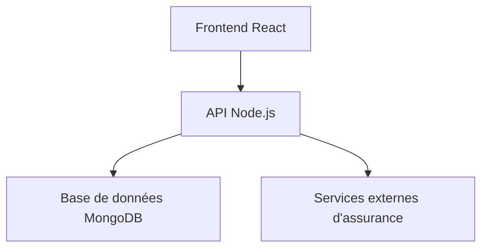

# MobiSoft Assurance - Plateforme de Devis d'Assurance Auto

## 1. Aperçu du Projet
**Objectif** : Plateforme web pour générer des devis d'assurance automobile en Côte d'Ivoire.

**Problèmes résolus** :
- Simplification du processus de souscription
- Comparaison transparente des offres
- Expérience utilisateur optimisée

**Public cible** :
- Particuliers cherchant une assurance auto
- Courtiers en assurance
- Agents des compagnies d'assurance

## 2. Architecture du Système


**Stack technique** :
- Frontend : React 18, TypeScript 5, Vite
- Backend : Node.js 20, Express
- Base de données : MongoDB Atlas
- Analyse : Google Analytics, Mixpanel

## 3. Fonctionnalités Principales

### Formulaire de Devis (QuoteForm)
- Processus en 3 étapes :
  1. Profil de l'assuré
  2. Détails du véhicule
  3. Options d'assurance

**Exemple d'utilisation** :
```tsx
<QuoteForm
  initialStep={0}
  formData={initialData}
  onInputChange={handleInputChange}
  onSubmit={handleSubmit}
/>
```

## 4. Guide de Développement

### Prérequis
- Node.js 20+
- MongoDB 6+
- Yarn 1.22+

### Installation
```bash
git clone https://github.com/mobisoft/assurance.git
cd assurance
yarn install
```

### Variables d'environnement
```env
VITE_API_URL=https://api.mobisoft.ci
VITE_GA_TRACKING_ID=UA-XXXXX-Y
```

## 5. Informations Opérationnelles

**Performances** :
- Temps de chargement moyen : <2s
- Prise en charge de 1000 requêtes/min

**Sécurité** :
- Chiffrement AES-256 des données sensibles
- Validation JWT pour les API

## 6. Maintenance

**Prochaines améliorations** :
- Intégration de paiement en ligne
- Portail client pour gestion des polices

**Support** :
contact@mobisoft.ci